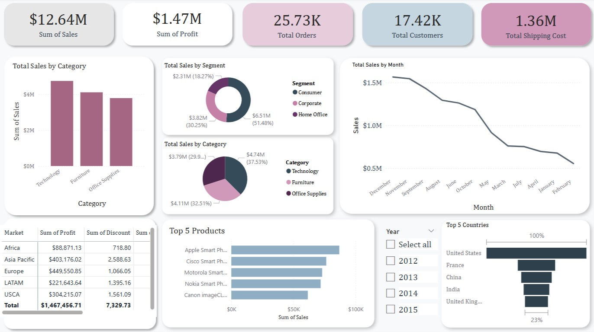

# Global Superstore Dashboard – Power BI Analysis

### Sales & Performance Visualization

This project presents an interactive **Power BI dashboard** developed to visualize and analyze key performance metrics such as sales, profits, orders, and customer behavior. It provides a comprehensive business intelligence overview across products, segments, regions, and time periods.

---

### Key Features

- **KPI Summary Cards**  
  - Total Sales  
  - Total Profit  
  - Total Orders  
  - Total Customers  
  - Total Shipping Cost

- **Visual Components**  
  - **Bar Chart**: Total Sales by Category  
  - **Donut Charts**:  
    - Sales by Segment (Consumer, Corporate, Home Office)  
    - Sales by Category (Technology, Furniture, Office Supplies)  
  - **Line Chart**: Monthly Sales Trend  
  - **Data Table**: Profit & Discount by Region  
  - **Horizontal Bar Chart**: Top 5 Products by Sales  
  - **Funnel Chart**: Top 5 Countries by Sales Contribution  
  - **Year Slicer**: Filter data by year (2012–2015)

---

### Tools & Technologies Used

- **Microsoft Power BI Desktop**  
- **DAX (Data Analysis Expressions)**  
- **Power Query Editor**  
- Custom themes and layout formatting

---

### Business Objectives

This dashboard enables decision-makers to:

- Monitor sales and profitability KPIs over time  
- Identify best-selling products and high-performing regions  
- Understand customer and order trends  
- Support data-driven strategic planning

---

### Sample Dashboard

---

### Key Insights

- **Top Categories**: Technology and Furniture lead in total sales.  
- **Top Segment**: Home Office contributes the largest portion of sales (over 51%).  
- **Top Country**: The United States dominates country-level sales contributions.  
- **Trend**: A noticeable decline in sales begins after December.

---
